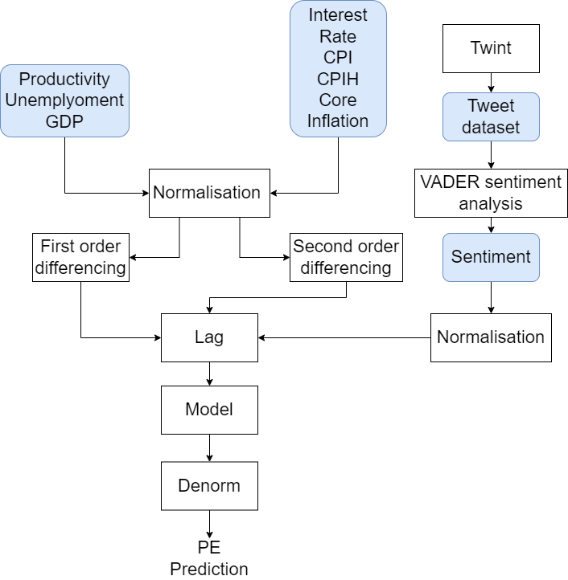
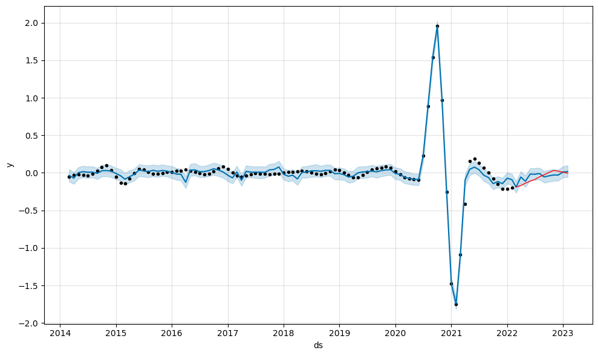

 &emsp;
 &emsp;
 &emsp;
 &emsp;
 &emsp;
 &emsp;

Table of Contents
=================

* [Predicting the Performance of the UK Luxury Fashion Industry](#predicting-the-performance-of-the-uk-luxury-fashion-industry)
   * [Motivation](#motivation)
   * [Achievements](#achievements)
   * [Final Report](#final-report)
      * [**Contributors**](#contributors)

# Predicting the Performance of the UK Luxury Fashion Industry

## Motivation

Predicting the performance of various sectors of industry in the United Kingdom (UK) has a range of benefits. Whether you are a member of the government working to guide economic policy or a private investor performing due diligence before making a decision on purchasing shares in a company; having an idea of how various companies will perform in the future provides essential insight to any decision-making process. In this report, the authors investigate how various economic indicators can be used to predict the performance of the UK luxury fashion sector. 

## Achievements

A dataset of macroeconomic indicators is created with a monthly sampling frequency. It includes a “Sentiment” feature to gauge public opinion towards the UK government. The goal is to use these indicators to predict the UK’s economic health and, in turn, the willingness of consumers to spend on luxury goods.

  

During the analysis of the dataset, the authors chose the price-earnings ratio (PE) as the target variable. This is because it reflects the market’s opinion of the luxury fashion industry by considering both the share price and the company’s actual performance through its earnings.

Various time-series models were trained and tested using this dataset. These models were then compared against each other. The trained time-series models include:

- Last Observation Carried Forward (LOCF)
- Simple Moving Average (SMA)
- Exponential Moving Average (EMA)
- XGBoost
- Monte Carlo Simulation
- Prophet

Prophet was found to be the best performing model, achieving a MAPE of $11.36\%$. The training and validation of the prophet model is shown in [this Jupyter notebook](prophet.ipynb)

  

The performance of each model is shown in the table below.

| Method | MAPE (%) |
| --- | --- |
| Last Observation Carried Forward (LOCF) | 104.64 |
| Simple Moving Average (SMA) | 95.93 |
| Exponential Moving Average (EMA) | 97.28 |
| XGBoost | 157 |
| Monte Carlo Simulation | 22.6 |
| Prophet | 11.36 |

## Final Report
The methodology, results and analysis are discussed in the [final report](final_report.pdf).

### **Contributors**
`Joel Edgar`

`Benjamin Sanati`

`Sayedur Khan`

`Adam Ali`

`Adwaith Kakkadath Palat`
